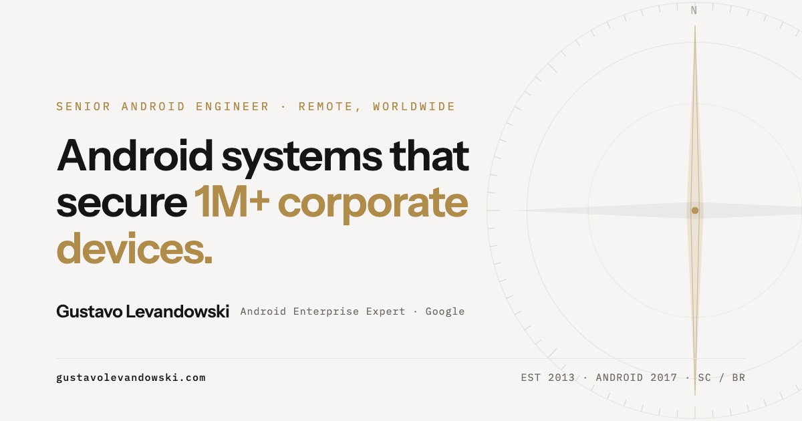

<p align="center">
  
</p>

<p align="center">
  
</p>

<h1 align="center">gustavolevandowski.com</h1>

<p align="center">
  <strong>Site pessoal e portfólio técnico</strong> de Gustavo Levandowski — Senior Android Engineer, Android Enterprise Expert certificado pelo Google e fundador do <a href="https://movimentolecode.com">LeCode</a>.
</p>

<p align="center">
  <a href="https://gustavolevandowski.com"></a>
  
  
  
</p>

<p align="center">
  <a href="https://gustavolevandowski.com">Abrir o site</a> ·
  <a href="https://www.linkedin.com/in/levandowski/">LinkedIn</a> ·
  <a href="https://medium.com/@levandowski">Medium</a> ·
  <a href="https://movimentolecode.com">LeCode</a>
</p>

---

## Sobre

Página única, estática e sem build step, pensada como **referência técnica** em Android em escala e em carreira em programação. O conteúdo cobre sistemas em plataformas que protegem **mais de 1 milhão de dispositivos corporativos**, cases de engenharia (MDM, WebRTC, browser seguro, Android Enterprise Recommended), mentoria e FAQ orientado a SEO/AEO.

O design segue uma identidade editorial minimalista — fundo papel (`#F6F5F3`), tipografia Instrument Sans + IBM Plex Mono e o detalhe da **rosa dos ventos** como marca visual.

| | |
| --- | --- |
| **1M+** | Dispositivos corporativos gerenciados por sistemas construídos |
| **9+** | Anos de engenharia Android (código desde 2013) |
| **7** | Certificações Google Android Enterprise (até Expert) |
| **20K+** | Usuários no Local Chat, produto cofundado e lançado |

---

## O que o site entrega

### Experiência

- **Hero** com rosa dos ventos animada e CTAs para conversa e cases
- **Métricas** com contadores animados ao entrar na viewport
- **Quatro cases** com diagramas SVG interativos (replay no clique):
  1. **MDM** — gestão completa de dispositivos sobre AOSP
  2. **Remote Cast** — controle remoto em tempo real com WebRTC
  3. **Secure Browser** — navegador corporativo em camadas
  4. **Android Enterprise Recommended** — ~58 features para o selo global
- **Capacidades**, **sobre**, **recomendações** e faixa cinematográfica
- **FAQ** amplo (carreira, Android Enterprise, entrevistas técnicas)
- **Contato** com e-mail e WhatsApp

### Interação

| Recurso | Comportamento |
| --- | --- |
| **Compass HUD** | Indicador flutuante da seção atual; clique avança para a próxima |
| **EN / PT** | Alternância de idioma no cliente (preview); produção prevê rotas `/en` e `/pt` |
| **Reveal** | Entrada suave dos blocos via `IntersectionObserver` |
| **Diagramas** | Traçado animado na primeira visibilidade; clique redesenha |
| **Botões magnéticos** | Micro-movimento no hover (ponteiro fino) |
| **`prefers-reduced-motion`** | Animações reduzidas quando o SO pede |

### SEO e descoberta

- Meta tags Open Graph e Twitter Card (`og.jpg` 1200×630)
- JSON-LD: `ProfilePage`, `Person` e `FAQPage`
- Canonical, robots e descrição orientada a busca e answer engines
- Favicon SVG + PNG

---

## Estrutura do repositório

```text
gustavolevandowski-site/
├── index.html      # Página completa (markup, CSS, JS, schemas)
├── og-card.html    # Fonte visual do card de compartilhamento
├── og.jpg          # Imagem Open Graph / Twitter (1200×630)
├── favicon.svg     # Ícone vetorial da marca
├── favicon.png     # Fallback PNG 32×32
└── README.md
```

Tudo vive em um único `index.html` de propósito: deploy trivial, sem bundler, sem dependências de runtime.

---

## Como rodar localmente

Não há instalação. Qualquer servidor estático serve.

```bash
# Python
python3 -m http.server 8080

# Node (se tiver npx)
npx serve .

# PHP
php -S localhost:8080
```

Abra [http://localhost:8080](http://localhost:8080).

> Abrir o `index.html` direto pelo `file://` funciona para a maior parte da página, mas um servidor local evita surpresas com fontes e caminhos.

---

## Regenerar o card Open Graph

O `og.jpg` é exportado a partir de `og-card.html` (canvas fixo 1200×630).

1. Abra `og-card.html` no navegador (idealmente em 1200×630 ou com zoom 100%).
2. Capture a viewport (DevTools → device metrics, ou ferramenta de screenshot full-page limitada ao body).
3. Exporte como JPEG de qualidade alta e substitua `og.jpg` na raiz.
4. No deploy, o arquivo precisa ficar na **raiz do domínio**, junto com o `index.html`, porque as meta tags apontam para:

```text
https://gustavolevandowski.com/og.jpg
```

---

## Design system (tokens)

| Token | Valor | Uso |
| --- | --- | --- |
| Surface | `#F6F5F3` | Fundo papel |
| Ink | `#161513` | Texto principal |
| Ink muted | `#6E6B66` / `#A3A099` | Secundário |
| Gold | `#B08C4A` | Destaque e marca |
| Hairline | `#E8E6E2` | Bordas |
| Display | Instrument Sans | Títulos e corpo |
| Mono | IBM Plex Mono | Labels, nav, métricas |

A rosa dos ventos (compass rose) aparece no hero, no HUD, no favicon e no card OG — é o fio visual do projeto.

---

## Seções da página

```text
Nav (fixa) + toggle EN/PT
│
├── Hero
├── Proof (métricas)
├── Work (4 cases + diagramas)
├── Capabilities
├── About
├── Endorsements
├── Field (faixa visual)
├── FAQ
├── Contact
└── Footer
```

O HUD da bússola acompanha a seção sob o centro da viewport e permite pular para a próxima com um clique (ou Enter/Espaço).

---

## Deploy

Qualquer host de arquivos estáticos serve o projeto:

- [GitHub Pages](https://pages.github.com/)
- [Cloudflare Pages](https://pages.cloudflare.com/)
- [Netlify](https://www.netlify.com/)
- [Vercel](https://vercel.com/)
- Bucket S3 / qualquer CDN

Publique a raiz do repositório. Em produção, o comentário no `index.html` recomenda servir **EN e PT em rotas separadas** (`/en`, `/pt`) com `hreflang`, em vez de depender só do toggle client-side — o arquivo único é o build de preview/conteúdo unificado.

---

## Contato

| Canal | Link |
| --- | --- |
| Site | [gustavolevandowski.com](https://gustavolevandowski.com) |
| E-mail | [contato@gustavolevandowski.com](mailto:contato@gustavolevandowski.com) |
| LinkedIn | [linkedin.com/in/levandowski](https://www.linkedin.com/in/levandowski/) |
| Medium | [medium.com/@levandowski](https://medium.com/@levandowski) |
| LeCode | [movimentolecode.com](https://movimentolecode.com) |
| Instagram | [@lecode.oficial](https://www.instagram.com/lecode.oficial/) |

---

<p align="center">
  <br>
  <sub>EST 2013 · ANDROID 2017 · SC / BR · Remote, worldwide</sub>
</p>
